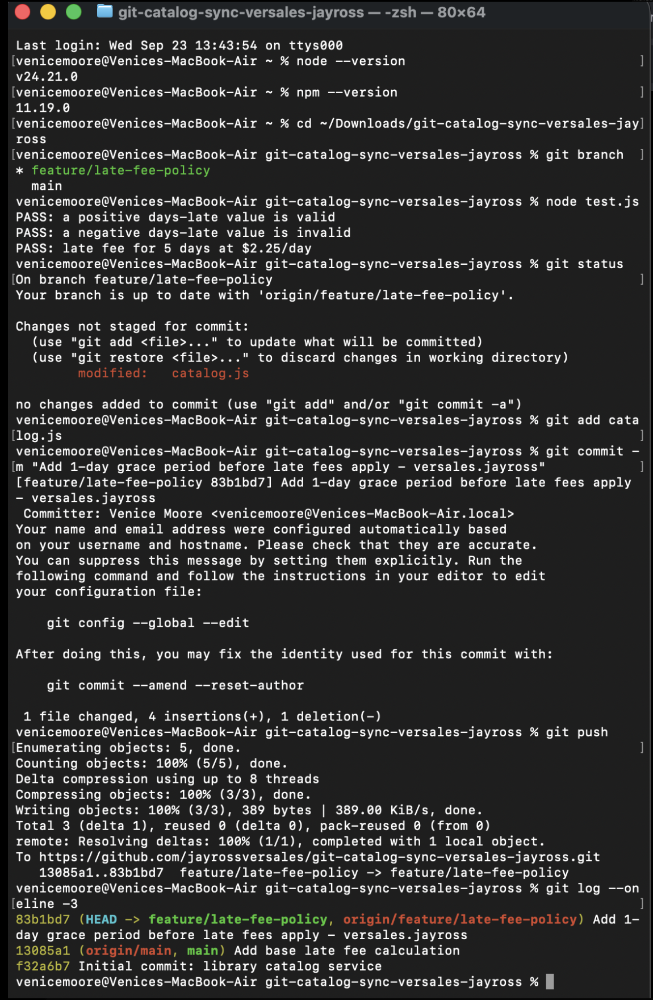
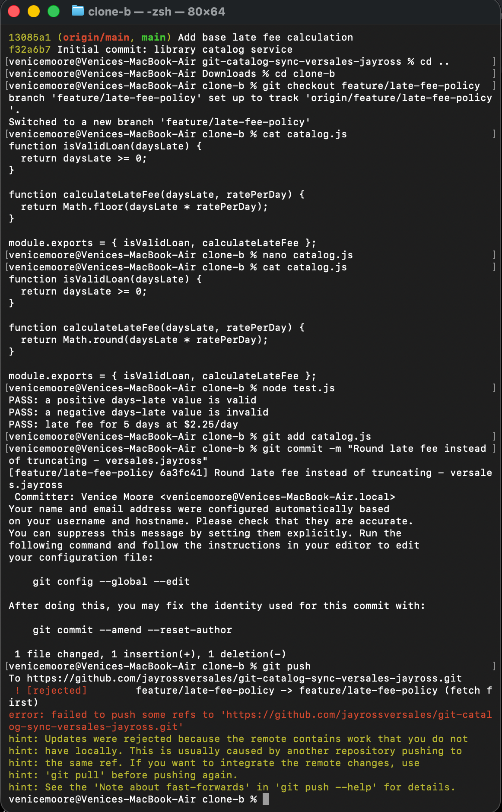
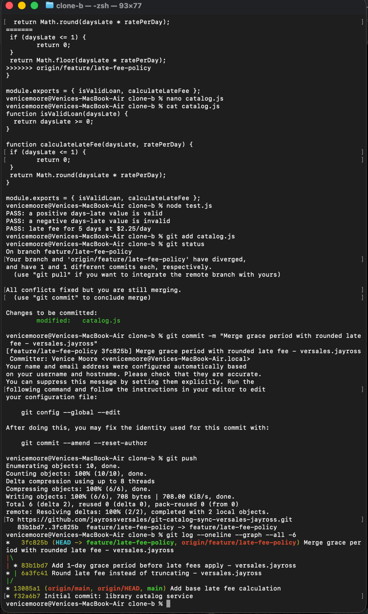
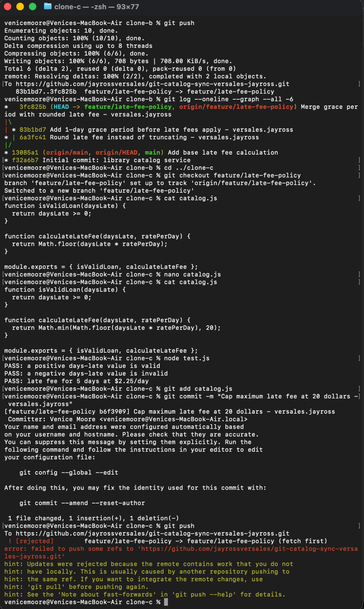
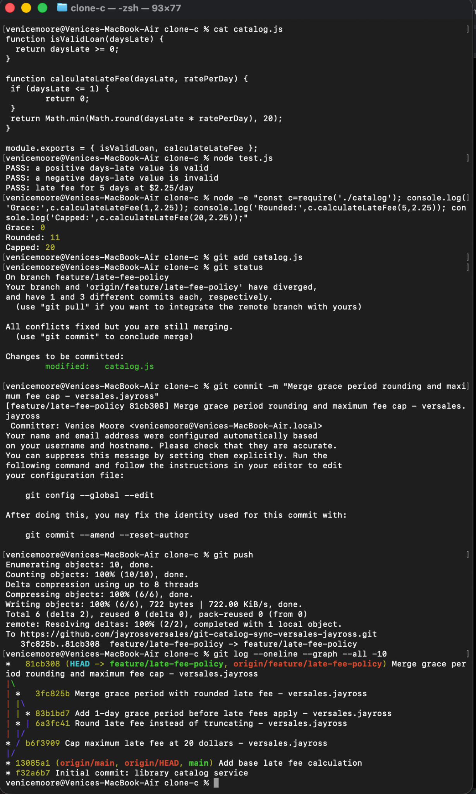
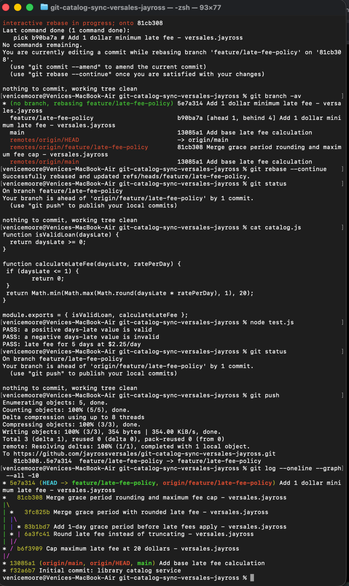
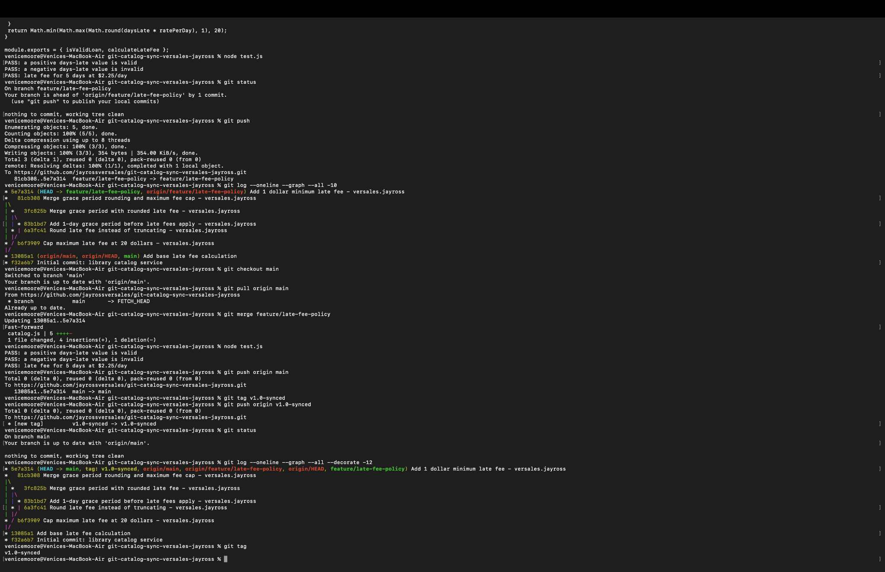

# Git Catalog Sync Workflow

Name: Jayross P. Versales

## Task 1 – Create and Push the Grace Period Change
Updated `catalog.js` on the `feature/late-fee-policy` branch to add a 1-day grace period before late fees apply. Tested the change, committed it, and pushed it to the remote repository.

Evidence: 

## Task 2 – Simulate a Concurrent Change
Using Clone B, changed the late-fee calculation from `Math.floor()` to `Math.round()`. After committing the change, the push was rejected because the remote branch already contained newer changes.

Evidence:

## Task 3 – Resolve the First Conflict
Integrated the remote grace-period change with the local rounding change. The conflict in `catalog.js` was manually resolved so that both changes were preserved. Tests passed before committing and pushing the merged result.

Evidence: 

## Task 4 – Create Another Concurrent Change
Using Clone C, added a maximum late-fee cap of $20. The local change was committed, but the first push was rejected because the remote branch had newer commits.

Evidence:

## Task 5 – Resolve the Second Conflict
Resolved the conflict by combining the 1-day grace period, rounded late-fee calculation, and $20 maximum fee cap. The combined behavior was tested successfully before committing and pushing.

Evidence:

## Task 6 – Rebase the Minimum Fee Change
Added a minimum late fee of $1 and rebased the local work onto the updated `feature/late-fee-policy` branch. After the rebase completed successfully, the tests passed and the updated branch was pushed.

Evidence:

## Task 7 – Merge to Main and Tag the Final Version
Merged `feature/late-fee-policy` into `main`, ran the tests successfully, and pushed the updated `main` branch. The completed synchronized version was tagged as `v1.0-synced` and the tag was pushed to the remote repository.

Evidence:

## Final Late Fee Policy
The final implementation:
- Provides a 1-day grace period.
- Rounds the calculated late fee.
- Applies a minimum late fee of $1 after the grace period.
- Caps the maximum late fee at $20.

This activity demonstrated Git branching, concurrent development, rejected pushes, conflict resolution, merging, rebasing, synchronization with a remote repository, and tagging.

## Written Answers

### 1. Final calculateLateFee Function

The final calculateLateFee function contains all four changes. Clone A added the 1-day grace period, which returns 0 when daysLate is 1 or less. Clone B changed Math.floor() to Math.round(), so the late fee is rounded instead of truncated. Clone C added the $20 maximum fee using Math.min(). Finally, Clone A added the $1 minimum fee using Math.max(). These changes work together so the grace period is checked first, while fees after the grace period are rounded and kept between $1 and $20.

### 2. Task 3 Two-Way Conflict vs. Task 5 Three-Way Conflict

Task 3 was simpler because I only had to reconcile two changes: Clone A's grace period and Clone B's rounding change. Task 5 was more difficult because Clone C was still based on the original version while the remote branch already contained the combined changes from Clone A and Clone B. I had to make sure the grace period and rounding were preserved while also adding Clone C's $20 maximum fee.

### 3. Merge vs. Rebase

In Task 5, I used a merge to combine Clone C's work with the updated remote branch. The histories remained separate and Git created a merge commit after I resolved the conflict. In Task 6, I used a rebase instead. Git replayed Clone A's $1 minimum-fee change on top of the latest remote history. This kept the new change on top of the updated branch instead of creating another merge commit.

### 4. Preventing the Rejected Pushes

If this were a real team, I would require each contributor to synchronize with the remote branch before starting work and again before pushing. Regularly fetching and integrating the latest changes would reduce the chance of contributors working from outdated versions of the shared branch and would prevent most of the rejected pushes in this activity.
